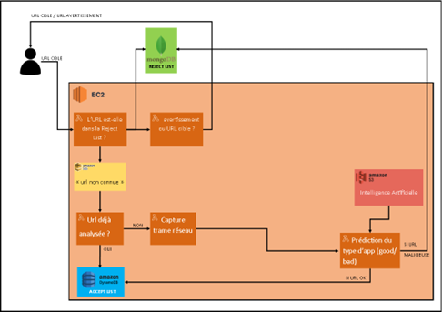

# architecture-cloud

## Overview
 1. [Initialization](#initialization)
 2. [Architecture](#Architecture)
 3. [Documentation](#Documentation)

## Initialization

first, you need to clone this git by typing in the terminal 
`git clone https://github.com/maaelle/architecture_network_analysis.git`.

Then, you have to register to AWS CLI, so type in the terminal `aws configure` and put your IAM key.

Once you finished to register to AWS CLI, you can type in the terminal `terraform init` and then `terraform apply`

> **Warning**
> don't use `terraform apply` for now because it's not finished

## Architecture

The AI is in this [GitHub repository](https://github.com/clementreiffers/network_analysis).

### Goal of our Project

The goal of our project is to protect the final user. 
So our project could be simplified by this bloc-schema below.

```mermaid
graph LR

USR[user]
DNS[is the website malicious ?]

USR --> |Give his target URL| DNS
DNS --> |Yes| USR
DNS --> |No| USR
```
If the URL is malicious, so we send a warning to the user, otherwise we permit the direct access to the URL.

### The prediction

Our first idea was the prediction of all URL that all user wanted. 
It could work but all networks catching and predictions cost a lot of execution time, so it harms the final user 
who just wanted to be safe. We want the speediest system.

```mermaid 
graph LR
USR[User]
L1[Catching network packet]
L2[Prediction kind of app]
L3[Is it malicious?]

USR --> L1
L1 --> L2
L2 --> L3
L3 --> USR
```

So we searched a solution to get to this problem.

### Saving old Predictions

So we add 2 databases to this architecture as below:

This 2 databases serve to save to kind of data :
- the first one serve to store all rejected URL
- the second serve to store all accepted URL

This architecture permits to not predict 2 times the same URL, the user isn't harm by an execution cost provided by 
the prediction and the network catching.

There is 2 ways for the user :
- If a URL is in the reject list, the user receive a warning.
- If a URL is not in the reject list, so the URL will fill an AWS SQS and will be verified by the AI in order to fill 
the databases, there is 2 ways for this URL:
  - If it has been accepted before, we analyse the next URL in the AWS SQS
  - If it has not been accepted before, so the URL is totally unknown, so it pass in the 2 lambdas seen before, so 
  the network catching and the prediction. If the AI predicted this URL as a bad one, it fills the reject list otherwise
  it fills the accepted list.

This architecture save a lot of time for the user, but we need to improve continually our AI, we need refitting, so we 
searched ways to improve this AI.

### Refitting of our AI

## Documentation

1. Redis et AWS : https://redis.com/blog/serverless-development-with-aws-lambda-and-redis-enterprise-cloud/
2. Redis et TF: https://developer.redis.com/create/aws/terraform/
